PDF-LIB SAMPLE Maintenance Report
=================

Intro
--------------

Inspirated by ... i made a sample app, which is 

- open Report in other Tab/Window
- handling save changed Form 
- handling form check / form completion

## Sample Report Form

In the Web i found also this pdf document **main_monthly-preventive-maintenance-report-template.pdf**
Based on this, I created a pdf-lib form as a fillable template pdf **TEMPLATE_MAINENANCE_REPORT.pdf**.
In this sample express-socket-io-App you can fill out this template. 

## Start sample 

Start this app with **npm start**.
Than you open in a web browser this URL **http:\\localhost:3000**

###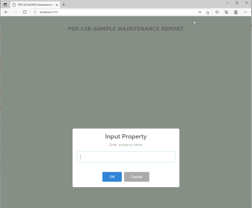   start app

Before you call the report form input a property name.

###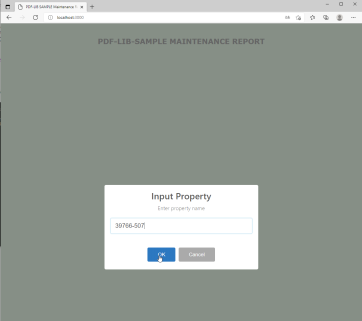   put in a property name

This opend the report pdf file second times.
The focused tab show the pdf form with the inserted input value.

###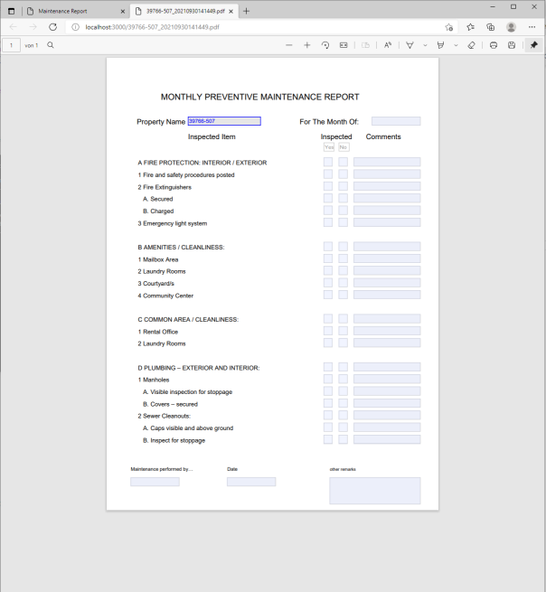   Display the PDF Form

For a separately processing of this form was create a web page with the option to show the pdf document in a iframe. To use this put on Tab **Maintenance Report**. 

###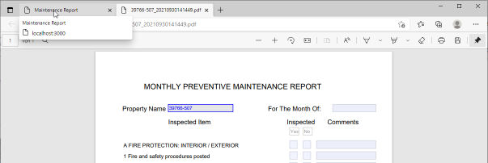   Switch to Maintenance Report

## Further Steps/Options

In both tabs/windows you have the chance to fill out the form and save the changes.

###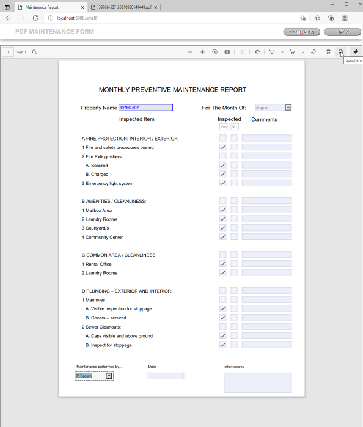   Using Browser build-in function 

Here is show the feature in the Edge Browser:

###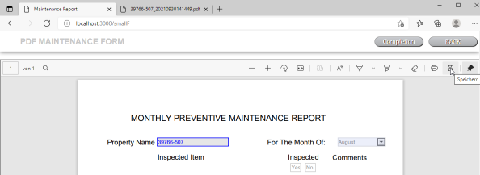   MS Edge browser built-in pdf save dialog

###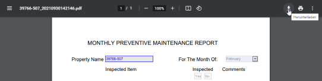   Chrome browser built-in pdf save dialog

###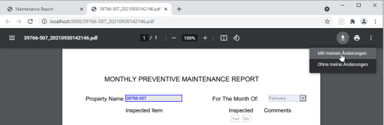   Chrome browser built-in pdf save dialog option with changes

You can save the document in any folder, but for a further processing it is defined a (sample) structure:

    c:\temp\reports   -   here should you save the filled out documents

    c:\temp\reports\completion  - this is the (sample) finish folder for completed reports.    

###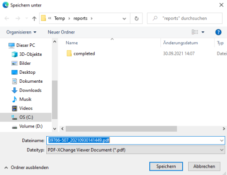   Save-As-Dialog

If the document saved in the defined folder you can start a checking process.

###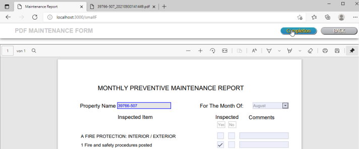   Button Completion

In the sample app is checking for the Person name, who is maked the preventive maintenance.
Is them so, then the document is moved to the completion folder.

###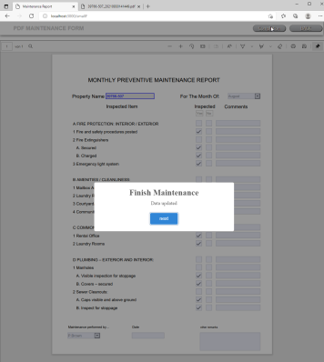   finish
